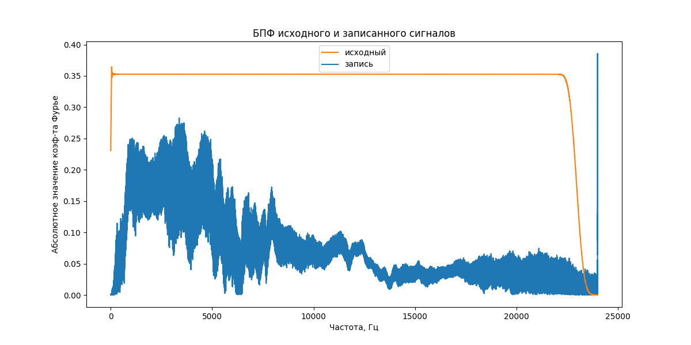

Этот репозиторий предназначен для проекта по курсу "Цифровая обработка сигналов".

# Подготовка

Для работы с репозиторием нужно его склонировать:

```
git clone https://github.com/TopCoder2K/dsp-project.git
```

А после установить зависимости:

```
poetry install --without dev
```

Если не стоит poetry, то нужно
[установить](https://python-poetry.org/docs/#installing-with-the-official-installer).

# Модуль 1

Сначала нужно получить АЧХ колонок, потом импульсный отклик выбранного помещения, потом
свернуть тестовый сигнал с полученным импульсным откликом и сравнить результат с реальным.

## Подготовка данных

Свипер и розовый шум было решено качать с audiocheck
([ссылка](https://www.audiocheck.net/testtones_highdefinitionaudio.php)), так как там не
требуется регистрация. Но за это платим уменьшением частоты дискретизации в 2 раза. Для
этого нужно скачать 96-ти килогерцовые свип и розовый шум и поместить их в папку `data`, а
после запустить

```
poetry run python3 data/downsample.py
```

Тестовый файл также нужно положить в папку `data`.

Все записи на диктофон (использовалось стандартное приложение из Andoid 13, а в качестве
микрофона --- микрофон телефона Realme GT Neo 3T), которые я делал для выполнения этого
модуля, лежат в [этой](https://disk.yandex.ru/d/D79WLiQKnvH_wg) папке на Яндекс Диске.
Оттуда их можно и нужно скачать и расположить в папке `data`. Папка содержит следующие
файлы:

- `recorded_sweep_cropped.wav` --- воспроизведение свипера через ноутбук (если верить
  Ubuntu, то частота дискретизации равна 48000)
- `recorded_corrected_pink_noize_cropped.wav`
- `recorded_gt_cropped.wav`

## Получение импульсного отклика и преобразование тестового сигнала

### Запись свипа

Чтобы минимизировать влияние отражений и фоновых звуков, запись велась в шкафу,
заполненном вещами. Здесь есть две оговорки:

- так как держать ноутбук и телефон вместе неудобно, я положил их на картонную коробку,
  что, с одной стороны, избавило от звуков трения об одежду и моего дыхания, но, с другой
  стороны, могло добавить отражений от этой коробки,
- так как у ноутбука 2 колонки, я открыл дверь шкафа, чтобы не было отражений от неё, а
  телефон положил к дальней от двери колонке.

Запись получилась покороче свипера (примерно на 0.3 секунды). Вероятно, дело в том, что
совсем низкие частоты настолько плохо воспроизводятся ноутбуком, что были заглушены звуком
нажатия на кнопку "Space" (для воспроизведения) и поэтому были обрезаны мною (я
ориентировался на "тишину", следующую сразу за звуком нажатия на кнопку). Из-за такого
различия после загрузки файла в коде я добавил нули в начало, чтобы выровнять длины
(разница в длинах --- примерно 10.000). Ниже представлены спектрограммы оригинального
свипа и записанного: 

### Симуляция реверберации

В качестве помещения я решил выбрать ванную одной из квартир 12-го общежития, так как там
особенно хорошо слышна реверберация. Для получения подправленных розового шума и тестового
сигнала нужно запустить:

```
poetry run python3 module1.py save_corrected_noize_and_gt --bins_cnt 32
```

(Число бинов можно задать любым натуральным числом, но эксперименты проводились для 32
бинов.)

Так как подправленный тестовый файл `afc_corrected_test_48kHz.wav` получился слишком
подправленным, я не увидел смысла проводить с ним эксперименты: колонки явно меньше портят
звук, поэтому записал воспроизведение оригинального `gt.wav`, который лежит на Яндекс
Диске под именем `recorded_gt_cropped.wav`. Получение импульсного отклика и предсказанного
результата воспроизведения в ванной делается через команду:

```
poetry run python3 module1.py get_impulse_responce_and_test
```

### Анализ результатов

Если сравнивать `gt.wav`, `recorded_gt_corrected.wav` и `predicted_gt.wav` между собой, то
такое ощущение, что `predicted_gt.wav` --- это просто `gt.wav`, сделанный потише. Никакой
реверберации там неслышно. Я решил посмотреть на получающееся значение `impulse_responce`,
и там всего лишь одно число... Что ж, тут остаётся только довериться `scipy`, так как
ошибок я не вижу.

# Модуль 2 (TBD)

# Модуль 3 (TBD)

# Модуль 4 (TBD)
