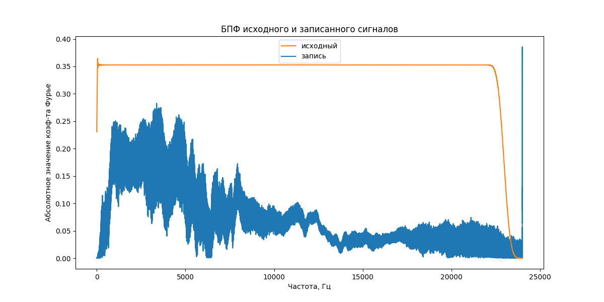

Этот репозиторий предназначен для проекта по курсу "Цифровая обработка сигналов".

# Подготовка

Для работы с репозиторием нужно его склонировать:

```
git clone https://github.com/TopCoder2K/dsp-project.git
```

А после установить зависимости:

```
poetry install --without dev
```

Если не стоит poetry, то нужно
[установить](https://python-poetry.org/docs/#installing-with-the-official-installer).

# Модуль 1

Сначала нужно получить АЧХ колонок, потом импульсный отклик выбранного помещения, потом
свернуть тестовый сигнал с полученным импульсным откликом и сравнить результат с реальным.

## Подготовка данных

Свип и розовый шум было решено качать с audiocheck
([ссылка](https://www.audiocheck.net/testtones_highdefinitionaudio.php)), так как там не
требуется регистрация. Но за это платим уменьшением частоты дискретизации в 2 раза. Для
этого нужно скачать 96-ти килогерцовые свип и розовый шум и поместить их в папку
`data/module1`, а после запустить

```
poetry run python3 data/module1/downsample.py
```

Тестовый файл `gt.wav` также нужно положить в папку `data/module1`.

Все записи на диктофон (использовалось стандартное приложение из Andoid 13, а в качестве
микрофона --- микрофон телефона Realme GT Neo 3T), которые я делал для выполнения этого
модуля, лежат в папке `module1` внутри [этой](https://disk.yandex.ru/d/D79WLiQKnvH_wg)
папки на Яндекс Диске. Оттуда их можно и нужно скачать и расположить в папке `data`. Папка
`module1` содержит следующие файлы:

- `recorded_sweep_cropped.wav` --- воспроизведение свипа через ноутбук (если верить
  Ubuntu, то частота дискретизации записей тут и далее равна 48000)
- `recorded_corrected_pink_noise_cropped.wav` --- воспроизведение подправленного розового
  шума через ноутбук
- `recorded_gt_cropped.wav` --- воспроизведение тестового сигнала через ноутбук

## Получение импульсного отклика и преобразование тестового сигнала

### Запись свипа

Чтобы минимизировать влияние отражений и фоновых звуков, запись велась в шкафу,
заполненном вещами. Здесь есть две оговорки:

- так как держать ноутбук и телефон вместе неудобно, я положил их на картонную коробку,
  что, с одной стороны, избавило от звуков трения об одежду и моего дыхания, но, с другой
  стороны, могло добавить отражений от этой коробки,
- так как у ноутбука 2 колонки, я открыл дверь шкафа, чтобы не было отражений от неё, а
  телефон положил к дальней от двери колонке.

Запись получилась покороче свипера (примерно на 0.3 секунды). Вероятно, дело в том, что
совсем низкие частоты настолько плохо воспроизводятся ноутбуком, что были заглушены звуком
нажатия на кнопку "Space" (для воспроизведения) и поэтому были обрезаны мною (я
ориентировался на "тишину", следующую сразу за звуком нажатия на кнопку). Из-за такого
различия после загрузки файла в коде я добавил нули в начало, чтобы выровнять длины
(разница в длинах --- примерно 10.000). Ниже представлены спектрограммы оригинального
свипа и записанного:  (Также в папке `data/module1` можно
посмотреть этот график с учётом разбиения на бины).

### Симуляция реверберации

В качестве помещения я решил выбрать ванную одной из квартир 12-го общежития, так как там
особенно хорошо слышна реверберация. Для получения подправленных розового шума и тестового
сигнала нужно запустить:

```
poetry run python3 module1.py save_corrected_noise_and_gt --bins_cnt [value]
```

(Число бинов можно задать любым натуральным числом, но эксперименты проводились для
`--bins_cnt 32` бинов.)

Так как подправленный тестовый файл `32_bins_afc_corrected_test_48kHz.wav` получился
слишком подправленным, я не увидел смысла проводить с ним эксперименты: колонки явно
меньше портят звук, поэтому записал воспроизведение оригинального `gt.wav`, который лежит
на Яндекс Диске под именем `recorded_gt_cropped.wav`. Более того, если запустить команду
выше с `--bins_cnt 128`, то коррекция станет лишь немного получше. Похоже, что дело не в
плохой коррекции, а в чём-то ещё.

Получение импульсного отклика и предсказанного результата воспроизведения в ванной
делается через команду:

```
poetry run python3 module1.py get_impulse_responce_and_test
```

## Анализ результатов

Если сравнивать `gt.wav`, `recorded_gt_corrected.wav` и `predicted_gt.wav` между собой, то
такое ощущение, что `predicted_gt.wav` --- это просто `gt.wav`, сделанный потише. Никакой
реверберации там неслышно. Я решил посмотреть на получающееся значение `impulse_responce`,
и увидел, что там всего лишь одно число... Что ж, тут остаётся только довериться `scipy`,
так как ошибок я не вижу. Из улучшений можно предложить следующие:

- использовать профессиональный микрофон, так как у телефона, возможно, плоховат (хотя в
  повседневной жизни мне казалось, что он достаточно хороший),
- использовать какое-то специальное ПО для записи, потому что даже в дефолтном режиме
  приложение "Диктофон" делает какую-то обработку записываемого звука.

# Модуль 2

Нужно посчитать разные метрики на выбранных примерах.

## Подготовка данных и подсчёт SNR, SDR, SI-SDR, PESQ

Так как свёртка полученного импульсного отклика с исходным сигналом едва ли даёт какую-то
реверберацию, я решил выбрать "Интересный варинат" (да, да, именно так). Для этого нужно
скачать [шум метро](https://freesound.org/people/15GPanskaHladikova_Danuse/sounds/461143/)
и расположить его в папке `data/module2`. В качестве чистого голоса использовался файл
`gt.wav` из первого модуля.

Подумаем, как написать mixer. На вход ему подаются сигналы
$A_{\text{original}}, A_{\text{noise}}$ и значение $`SNR^*`$. На выходе должен получиться
сигнал $A_{\text{signal}} = A_{\text{original}} + kA_{\text{noise}}$, для которого верно
$`SNR^* = SNR(A_{\text{signal}}, A_{\text{noise}})`$. Выведем формулу для $k$:

```math
SNR^* = 10\log_{10}\frac{\langle A_{\text{original}}^2\rangle}{\langle (kA_{\text{noise}})^2\rangle}
\Longleftrightarrow \frac{\langle A_{\text{original}}^2\rangle}{k^2\langle A_{\text{noise}}^2\rangle}
= 10^{\frac{SNR^*}{10}}\\
\Longleftrightarrow k = \pm\sqrt{\frac{\langle A_{\text{original}}^2\rangle}{10^{\frac{SNR^*}{10}}\langle A_{\text{noise}}^2\rangle}}.
```

Для определённости я брал значение $k > 0$. Для получения SNR, SDR, SI-SDR, PESQ при
конкретном значении $`SNR^*`$ достаточно запустить

```
poetry run python3 module2.py calc_metrics_for_given_snr --snr_db [value]
```

(Я добавил **вычисление** метрики SNR для проверки корректности генерации смеси.)

## Подсчёт NISQA и DNSMOS, таблица с результатами

Для получения [NISQA](https://github.com/gabrielmittag/NISQA) и
[DNSMOS](https://github.com/microsoft/DNS-Challenge/tree/master/DNSMOS) нужно пройтись по
инструкциям с соответствующих репозиториев. Из-за нехватки времени я не стал встраивать
код репозиториев в свой код, а просто склонировал репозитории в отдельные папки и запустил
модели из них на `[snr_in_dB]_dB_mixture.wav` файлах.

Ниже я собрал метрики для всех запусков в таблицу:
|       Файл        |   SNR   |   SDR   |  SI-SDR |   PESQ  | NISQA, mos_pred | NISQA, noi_pred | NISQA, dis_pred | NISQA, col_pred | NISQA, loud_pred |  DNSMOS |   MOS   |
|:-----------------:|:-------:|:-------:|:-------:|:-------:|:---------------:|:---------------:|:---------------:|:---------------:|:----------------:|:-------:|:-------:|
| -5_dB_mixture.wav | -5.0000 | -5.0878 | -5.1124 |  1.0275 |      0.6341     |      1.3234     |      2.8905     |      1.5201     |      1.4479      |  2.1469 |    2    |
|  0_dB_mixture.wav |  0.0000 | -0.0512 | -0.0629 |  1.0422 |      0.8920     |      1.2968     |      3.8234     |      2.8119     |      2.2788      |  2.2924 |    3    |
|  5_dB_mixture.wav |  5.0000 |  4.9724 |  4.9648 |  1.0826 |      1.6883     |      1.2879     |      4.4103     |      3.7602     |      2.8792      |  2.5815 |    4    |
| 10_dB_mixture.wav | 10.0000 |  9.9867 |  9.9803 |  1.1862 |      2.5234     |      1.4233     |      4.4173     |      3.9947     |      3.5467      |  3.2040 |    4    |

## Анализ результатов

Можно сделать следующие выводы:

0. Смешивание реализовано правильно, так как посчитанное значение SNR полностью совпадает
   с точностью до $10^{-4}$ (на самом деле даже до $10^{-6}$);
1. SNR, SDR, SI-SDR довольно сильно коррелируют;
2. Все метрики "отмечают", что с ростом SNR качество становится лучше, однако
   перцептуальные метрики растут заметно медленнее аналитических;
3. PESQ как будто практически не различает эти 4 примера, т.е. она наименее скоррелирована
   со всеми остальными.

# Модуль 3

Нужно прогнать смеси из модуля 2 через
[DeepFilterNet2](https://github.com/Rikorose/DeepFilterNet/tree/main) и посмотреть, как
поменяются метрики.

## Подготовка данных

Для обработки с помощью DeepFilterNet2 я склонировал репозиторий, настроил среду через
`virtualenv` и запустил на файлах `[snr_in_dB]_dB_mixture.wav` (непонятно, имелось ли в
виду это под "инференсом в Python", но от написания .py файла это мало чем отличается).
Результаты работы выложил в папку `module3` внутри
[этой](https://disk.yandex.ru/d/D79WLiQKnvH_wg) папки на Яндекс Диске (внутри этой же
папки в `module2` лежат смеси и шум метро). Из `module3` нужно скачать обработанные файлы
и расположить в `data/module3`.

## Получение метрик

Повторим подсчёты, описанные в модуле 2. Для получения SNR, SDR, SI-SDR, PESQ нужно
запустить:

```
poetry run python3 module3.py calc_metrics_for_given_snr --snr_db [value]
```

А для получения NISQA и DNSMOS воспользоваться инструкциями из их репозиториев.

Результаты собраны в таблице ниже.
|               Файл               |   SNR   |   SDR   |  SI-SDR |   PESQ  | NISQA, mos_pred | NISQA, noi_pred | NISQA, dis_pred | NISQA, col_pred | NISQA, loud_pred |  DNSMOS |   MOS   |
|:--------------------------------:|:-------:|:-------:|:-------:|:-------:|:---------------:|:---------------:|:---------------:|:---------------:|:----------------:|:-------:|:-------:|
|         -5_dB_mixture.wav        | -5.0000 | -5.0878 | -5.1124 |  1.0275 |      0.6341     |      1.3234     |      2.8905     |      1.5201     |      1.4479      |  2.1469 |    2    |
| -5_dB_mixture_DeepFilterNet2.wav |  5.4761 |  5.1694 |  4.0779 |  1.2519 |      3.0117     |      3.7633     |      3.1751     |      3.1160     |      3.6086      |  3.2688 |    3    |
|          0_dB_mixture.wav        |  0.0000 | -0.0512 | -0.0629 |  1.0422 |      0.8920     |      1.2968     |      3.8234     |      2.8119     |      2.2788      |  2.2924 |    3    |
|  0_dB_mixture_DeepFilterNet2.wav |  9.2798 |  9.2151 |  8.7749 |  1.6262 |      4.0980     |      4.1810     |      4.1897     |      3.9241     |      4.2102      |  3.7859 |    4    |
|          5_dB_mixture.wav        |  5.0000 |  4.9724 |  4.9648 |  1.0826 |      1.6883     |      1.2879     |      4.4103     |      3.7602     |      2.8792      |  2.5815 |    4    |
|  5_dB_mixture_DeepFilterNet2.wav | 12.7039 | 12.7225 | 12.4936 |  2.0861 |      4.4595     |      4.3889     |      4.4507     |      4.1553     |      4.4419      |  3.9854 |    5    |
|         10_dB_mixture.wav        | 10.0000 |  9.9867 |  9.9803 |  1.1862 |      2.5234     |      1.4233     |      4.4173     |      3.9947     |      3.5467      |  3.2040 |    4    |
| 10_dB_mixture_DeepFilterNet2.wav | 16.0542 | 16.1074 | 15.9685 |  2.5979 |      4.5887     |      4.4746     |      4.5425     |      4.3044     |      4.5300      |  4.0807 |    5    |

## Анализ результатов

Дополнительно к выводам из модуля 2 можно сделать следующие выводы:

1. `DeepFilterNet2` действительно хорошо работает: сильно улучшаются аналитические метрики
   (на 6-10 единиц), PESQ заметно увеличивается (для 5 и 10 дБ улучшение в 2 раза), NISQA
   mos_pred, NISQA noi_pred и DNSMOS тоже значительно улучшаются (для NISQA кратные
   улучшения до 5 с чем-то раз, для DNSMOS --- до примерно 1.5 раз);
2. Похоже, что у DNSMOS шкала "шире", чем у NISQA mos_pred, потому что там улучшения
   заметно менее значительные.

# Модуль 4

Нужно исследовать зависимость качества переноса голоса с помощью
[kNN-VC](https://github.com/bshall/knn-vc) от различных длин записи с голосом целевого
говорящего.

## Подготовка данных

Внутри [этой](https://disk.yandex.ru/d/D79WLiQKnvH_wg) папки на Яндекс Диске есть папка
`module4`, которая содержит записи моего голоса (`repo_review.wav`) и голоса Ивана
Бескровного (`IvanBloodless.wav`), а также нарезки из этих двух записей разных длин
(продолжительность записей не совпадает с названием, потому что при назывании я
ориентировался на время, в течение которого что-то говорилось). Эти записи нужно скачать и
расположить в папке `data/module4`. В `module4` на Яндекс Диске также есть результаты
переноса при разных длинах таргетов в папке `Результаты`, так что можно сразу послушать.)

## Запуск Voice Transfer

Так как я в poetry использовал версию 3.9, то пришлось создавать новую среду для `kNN-VC`
(ему нужен 3.10 и выше). Я сделал файл `env_for_kNNVC.yml`, из которого с помощью команды

```
conda env create -f env_for_kNNVC.yml
```

можно создать среду с нужными зависимостями. Внутри среды `knnvc` для переноса голоса
нужно запустить

```
python3 module4.py downsample_then_convert --src_name [название_с_расширением] --target_core_name [общий_корень_у_таргетов]
```

Эта команда сделана для сценария, когда есть запись исходного голоса и разные записи
целевых голосов, который должны называться как
`[общий_корень]_[продолжительность]sec.wav`. Я использовал длины 4, 10, 20, 30, 40, 50, 60
сек. Пример запуска для озвучивания моим голосом кусочка лекции (ест примерно 7 Gb GPU
RAM!):

```
python3 module4.py downsample_then_convert --src_name IvanBloodless.wav --target_core_name repo_review
```

код сгенерирует 7 записей с названиями
`from_IvanBloodless_to_voice_from_repo_review_[время]sec.wav`.

## Анализ результатов

### С моего голоса на голос Ивана

Большая часть слов понятна уже при 4 секундах, но качество переноса ужасное: как будто
какой-то робот говорит. При 10 секундах уже практически все слова понятны, но говорит всё
та же жестяная банка. При 20 секундах ситуация особо не меняется: ещё немного почётче
становится произношение. При 30 секундах как будто бы даже становится хуже, потому что
появляются какие-то провалы в тоне (например, "мы" в начале). При 40, 50, 60 особо
улучшений нет, голос Ивана я вообще не узнаю.

### С голоса Ивана на мой

При 4 секундах получается какой-то азиат, пытающийся говорить на русском 😂😂😂. Слова
практически не разобрать, в общем перенос --- 💩💩💩. При 10 секундах всё ещё много
непонятных слов, при 20 секундах уже почти все слова понятны, и даже нет 🤖, как выше, но
голос свой я не узнаю. От голоса Ивана как будто бы почти тоже ничего нет... При 30 ещё
получше становится произношение, но моего голоса по-прежнему нет, как и при 40, 50 и 60.

### Общий вывод

Стоит отметить, что качество записи голоса Ивана так себе, потому что я записывал на
телефон кусок лекции, воспроизведённой через ноутбук. Это определённо внесло вклад, хотя
наши голоса вполне себе узнаются на записях, так что в моём случае `kNN-VC` плохо сработал
😢.
